# SI Lab 2 - Матеј Милевски 186079

## Прашање 2

## Прашање 3

Цикломатска комплексност на checkCart е 9 (8 контролни јазли + 1):

1. if (allItems == null) → +1
2. for (int i = 0; i < allItems.size(); i++) → +1
3. if (item.getName() == null || item.getName().length() == 0) → +1
4. if (item.getPrice() > 300 || item.getDiscount() > 0 || item.getQuantity() > 10) → +1
5. if (item.getDiscount() > 0) → +1
6. if (cardNumber != null && cardNumber.length() == 16) → +1
7. for (int j = 0; j < cardNumber.length(); j++) → +1
8. if (allowed.indexOf(c) == -1) → +1

## Прашање 4

Потребни се вкупно 6 тестови за да се постигне „Every Statement“ критериумот.

1. nullListThrows – покрива if (allItems == null)
2. nullItemNameThrows – покрива if (item.getName() == null)
3. emptyItemNameThrows – покрива if (item.getName().length() == 0)
4. mixedItemsValidSum – покрива гранењата за price>300, discount>0, нормално сумирање и патеката за враќање на sum
5. nullCardNumberThrows – покрива else гранчето кога cardNumber == null (или длина≠16)
6. invalidCardCharacterThrows – покрива фрлање при недозволен карактер во cardNumber

## Прашање 4

Потребни се вкупно 8 (2^3) тестови за да се постигне „Multiple Condition“ критериумот.

